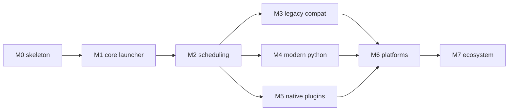

# CriKey delivery plan

Source of truth for scope: [`docs/spec/crikey-spec-v1.md`](spec/crikey-spec-v1.md).
Section references below (`§n`) point at that document. Where this plan makes a
choice the spec leaves open, the choice is recorded as an ADR in
[`docs/adr/`](adr/) and is binding until superseded.

Sizes are relative (S/M/L/XL), not calendar estimates.

---

## 1. Delivery principles

These are checked in review and encoded in tests. They outrank convenience.

1. **Isolation.** Third-party code never executes in the UI process (§5.1, §16.1).
2. **Non-blocking UI.** The UI thread renders; it never waits on plugin traffic (§6.5, §25.1).
3. **Generations are the truth.** Every query state has a monotonic generation; a
   result carrying an obsolete generation is discarded, never displayed (§8.1).
4. **Legacy is a separate contract.** `legacy-strict` gets obsolete-work
   replacement, serial callbacks, no time debounce, no host gating, no dynamic
   caching — modern optimizations are never silently applied to it (§7.1, §8.4, §14.5).
5. **Everything is bounded.** Every queue has a capacity and an explicit overflow
   policy; plugin traffic can never grow memory without limit (§12.4).
6. **Platform behind interfaces.** Platform-independent crates never call a
   desktop API; backends implement traits (§5.3, §18).
7. **Honest capabilities.** Unimplemented or unenforceable capabilities report
   `Unavailable`, never a plausible lie (§18.2, §20.2).

---

## 2. Component ownership

| Crate | Owns | Depends on |
| --- | --- | --- |
| `crikey-core` | generations, item/action model, ids, lossless paths, errors | — |
| `crikey-query` | normalization, tokenization, matching, highlights | core |
| `crikey-ranking` | ranking signals, default ranker, history policy | core, query |
| `crikey-catalog` | catalog store, persistence, per-plugin slices | core, query |
| `crikey-result-aggregator` | per-generation merge, dedup, limits, batching | core, ranking |
| `crikey-input-scheduler` | generation tracker, modern debouncer, legacy obsolete-work manager, cancellation | core |
| `crikey-plugin-model` | `crikey.toml`, permissions, activation and query policy | core |
| `crikey-plugin-supervisor` | worker lifecycle, deadlines, health, circuit breaking | core, plugin-model |
| `crikey-native-protocol` | wire schema, framing, handshake, capability negotiation | core |
| `crikey-native-host` | native subprocess launch/supervision | protocol, supervisor |
| `crikey-python-host` | CPython workers, runtime profiles, import path | protocol, supervisor |
| `crikey-legacy-compat` | Keypirinha-compatible API, package loading, `legacy-strict` | python-host, scheduler |
| `crikey-platform` | platform traits, capability reporting | core |
| `crikey-platform-{windows,macos,linux}` | per-OS backends | platform |
| `crikey-package-manager` | install, verify, lock, atomic update/rollback | plugin-model |
| `crikey-ui` | window, view model, keyboard commands | core |
| `crikey-app` | composition root, startup staging | most |
| `crikey-cli` | `crikey` binary (§28) | app |

Dependency direction is enforced: nothing depends on `crikey-app`, and only
`crikey-app` names a platform backend crate (via `cfg` target dependencies).

---

## 3. Milestones

### M0 — Skeleton (done)

Workspace, crate boundaries, plan and ADRs, CI, the generation tracker, the
modern debouncer, the legacy obsolete-work manager, and manifest parsing that
round-trips the specification's example verbatim.

Exit: `cargo test --workspace --all-targets` green on Linux; `crikey version` runs.

### M1 — Core launcher (§30 Phase 1) — XL

| Deliverable | Crates | Notes |
| --- | --- | --- |
| Query normalization + matcher | query | Unicode NFKC, case fold, tokens, prefix/substring/fuzzy/acronym |
| Default ranker | ranking | match quality, prefix bonus, position, category, score hint |
| Catalog store + persistent cache | catalog | zero-copy mmap load, per-plugin slices (ADR-0008) |
| Result aggregator | result-aggregator | generation gating, dedup by `ItemId`, limits |
| Launcher window | ui | winit + wgpu/egui, hidden-window warm activation (ADR-0002) |
| Global hotkey + app discovery | platform, platform-windows | Start Menu, `.lnk`, packaged apps, AppUserModelIDs |
| Startup staging | app | window/hotkey → cached catalog → accept queries → workers |
| Supervisor skeleton | plugin-supervisor | states, deadlines, health counters, no runtime yet |

Exit criteria: warm activation < 30 ms p95 and cached local results < 16 ms p95
on the reference machine; 500k synthetic items searchable; query text renders in
the next frame with no debounce (§25.1, §31.1–3, §31.27).

### M2 — Scheduling and resilience (§30 Phase 2) — L

Wires the M0 scheduling primitives into a live pipeline: per-plugin debounce
policy resolution from manifests, leading/trailing/max-wait, cancellation
propagation, stale-result rejection at the aggregator boundary, bounded request
and result queues with named overflow policies, per-plugin budgets and fair
queuing, and the developer query trace (§26.4).

Exit criteria: rapid-typing stress test shows bounded queue depth, zero stale
results displayed, no cross-generation reordering, and a slow plugin never
delaying a fast one (§31.4–8, §31.24–25).

### M3 — Legacy Compatibility Layer (§30 Phase 3) — XL

Legacy package discovery and loading (directories and `.keypirinha-package`),
the CPython legacy worker, `keypirinha` / `keypirinha_util` / `keypirinha_net` /
`keypirinha_wintypes` module implementations, legacy configuration parsing,
`legacy-strict` dispatch wired to `should_terminate()`, legacy event and
activation/deactivation coalescing semantics, the compatibility matrix as tested
data, and compatibility diagnostics (§26.2).

Exit criteria: the synthetic legacy test-plugin suite passes, including a plugin
that ignores `should_terminate()`; the real-plugin corpus is classified and
published; every acceptance item §31.11–18 has a test.

### M4 — Modern Python plugins (§30 Phase 4) — L

Python SDK worker loop over the v1 protocol, manifest/`pyproject` dependency
declaration, content-addressed managed environments with lockfiles and hash
verification, worker sharing rules, cancellation object, async callback support,
and `crikey dev` tooling for Python plugins.

Exit criteria: two plugins with conflicting dependency versions run
simultaneously; an interpreter crash does not affect CriKey (§31.10, §31.19–20).

### M5 — Native plugins (§30 Phase 5) — L

`sdk/protocol` v1 frozen and generated bindings, named-pipe/UDS transports,
native process supervision with restart and exit accounting, streaming catalogs
and suggestions with backpressure, Rust SDK, packaging and a conformance test
harness (`crikey dev inspect-protocol`).

Exit criteria: an out-of-tree Rust plugin connects, streams incremental results,
is cancelled mid-query, is killed, and is recovered (§31.21–23, §31.30).

### M6 — Additional platforms (§30 Phase 6) — L

macOS and Linux backends behind the same traits, honest capability reporting
per desktop environment, cross-platform packaging, portable built-ins.

Exit criteria: full test suite green on all three CI runners; Windows-only
legacy plugins are labelled as such and never advertised as portable (§31.26, §31.31).

### M7 — Optional runtimes and ecosystem (§30 Phase 7) — open-ended

WebAssembly runtime, signed packages, public plugin index, restricted C ABI,
advanced sandboxing, shared-memory transport — each gated on profiling or
demand evidence, not added speculatively.

---

## 4. Sequencing

M3, M4 and M5 are independent once M2 lands: they share only the protocol and
the supervisor contract, both frozen at the end of M2. The protocol schema in
`sdk/protocol` is therefore written during M2 even though M5 consumes it.

---

## 5. Cross-cutting workstreams

**Testing (§27).** Unit tests live beside the logic they defend; scheduling
tests take explicit timestamps so they never depend on wall-clock timing.
Integration tests (`tests/`) drive rapid typing, slow and crashing plugins,
config churn and filesystem storms. Stress tests (`benchmarks/`) cover 500k
items, hundreds of plugins, malformed IPC and fast-producer/slow-consumer.

**Diagnostics (§26).** Structured per-plugin logs, health counters and the query
trace are built alongside each subsystem, not retrofitted. A subsystem without
counters is incomplete.

**Performance (§25).** Every milestone that touches the hot path adds a
benchmark. Targets are measured on a documented reference machine and tracked
over time; regressions block the milestone.

**Legal and branding (§14.13).** `NOTICE.md` ships in every artefact. No
Keypirinha branding, logos, or implied endorsement anywhere in UI or docs.

---

## 6. Risks

| Risk | Impact | Mitigation |
| --- | --- | --- |
| Undocumented Keypirinha behaviour that real plugins depend on | Compatibility gaps found late | Build the real-plugin corpus during M3, not after; classify and publish gaps rather than guessing at internals |
| CPython startup cost inflating first-query latency | Misses §25.1 targets | Lazy worker start, warm pooling per runtime profile, catalog served from cache while workers boot |
| Warm-activation budget (30 ms p95) on a cold GPU surface | Misses §31.1 | Keep window and surface alive and hidden; measure from hotkey to first presented frame in CI-adjacent harness |
| Debounce tuning fighting perceived responsiveness | Poor feel | Local catalog is never debounced; defaults follow §25.4 bands and are per-plugin configurable |
| Protocol churn after third-party SDK release | Ecosystem breakage | Freeze v1 at M5 with additive-only evolution and unknown-field round-tripping |
| Scope creep from §2.2 "later scope" | M1–M6 slip | Later-scope items require an ADR and a milestone before any code lands |

---

## 7. Open decisions

Tracked as ADRs. Provisional ones carry an explicit revisit trigger.

| ADR | Decision | State |
| --- | --- | --- |
| [0001](adr/0001-workspace-layout.md) | Workspace layout and dependency direction | Accepted |
| [0002](adr/0002-ui-stack.md) | UI stack: winit + wgpu with an egui widget layer | Accepted (revisit if warm activation misses 30 ms p95) |
| [0003](adr/0003-concurrency-model.md) | Threading and async model | Accepted |
| [0004](adr/0004-plugin-ipc.md) | Protobuf over named pipes / UDS / stdio | Accepted |
| [0005](adr/0005-python-hosting.md) | Out-of-process CPython workers, no in-process interpreter | Accepted |
| [0006](adr/0006-legacy-scheduling.md) | Obsolete-work replacement for `legacy-strict` | Accepted |
| [0007](adr/0007-path-representation.md) | Lossless platform paths across IPC | Accepted |
| [0008](adr/0008-catalog-persistence.md) | Zero-copy memory-mapped catalog cache | Provisional |
| [0009](adr/0009-branding-and-attribution.md) | Branding and attribution rules | Accepted |
