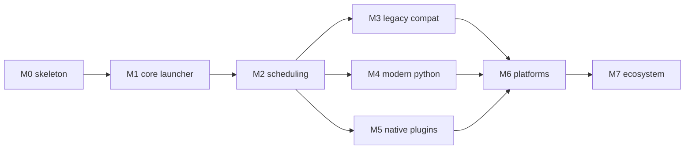

# CriKey delivery plan

Source of truth for scope: [`docs/spec/crikey-spec-v1.md`](spec/crikey-spec-v1.md).
Section references below (`§n`) point at that document. Where this plan makes a
choice the spec leaves open, the choice is recorded as an ADR in
[`docs/adr/`](adr/) and is binding until superseded.

Sizes are relative (S/M/L/XL), not calendar estimates.

---

## 1. Delivery principles

These are checked in review and encoded in tests. They outrank convenience.

1. **Isolation.** Third-party code never executes in the UI process (§5.1, §16.1).
2. **Non-blocking UI.** The UI thread renders; it never waits on plugin traffic (§6.5, §25.1).
3. **Generations are the truth.** Every query state has a monotonic generation; a
   result carrying an obsolete generation is discarded, never displayed (§8.1).
4. **Legacy is a separate contract.** `legacy-strict` gets obsolete-work
   replacement, serial callbacks, no time debounce, no host gating, no dynamic
   caching — modern optimizations are never silently applied to it (§7.1, §8.4, §14.5).
5. **Everything is bounded.** Every queue has a capacity and an explicit overflow
   policy; plugin traffic can never grow memory without limit (§12.4).
6. **Platform behind interfaces.** Platform-independent crates never call a
   desktop API; backends implement traits (§5.3, §18).
7. **Honest capabilities.** Unimplemented or unenforceable capabilities report
   `Unavailable`, never a plausible lie (§18.2, §20.2).

---

## 2. Component ownership

| Crate | Owns | Depends on |
| --- | --- | --- |
| `crikey-core` | generations, item/action model, ids, lossless paths, errors | — |
| `crikey-query` | normalization, tokenization, matching, highlights | core |
| `crikey-ranking` | ranking signals, default ranker, history policy | core, query |
| `crikey-catalog` | catalog store, persistence, per-plugin slices | core, query |
| `crikey-result-aggregator` | per-generation merge, dedup, limits, batching | core, ranking |
| `crikey-input-scheduler` | generation tracker, modern debouncer, legacy obsolete-work manager, cancellation | core |
| `crikey-plugin-model` | `crikey.toml`, permissions, activation and query policy | core |
| `crikey-plugin-supervisor` | worker lifecycle, deadlines, health, circuit breaking | core, plugin-model |
| `crikey-native-protocol` | wire schema, framing, handshake, capability negotiation | core |
| `crikey-native-host` | native subprocess launch/supervision | protocol, supervisor |
| `crikey-python-host` | CPython workers, runtime profiles, import path | protocol, supervisor |
| `crikey-legacy-compat` | Keypirinha-compatible API, package loading, `legacy-strict` | python-host, scheduler |
| `crikey-platform` | platform traits, capability reporting | core |
| `crikey-platform-{windows,macos,linux}` | per-OS backends | platform |
| `crikey-package-manager` | install, verify, lock, atomic update/rollback | plugin-model |
| `crikey-ui` | window, view model, keyboard commands | core |
| `crikey-app` | composition root, startup staging | most |
| `crikey-cli` | `crikey` binary (§28) | app |

Dependency direction is enforced: nothing depends on `crikey-app`, and only
`crikey-app` names a platform backend crate (via `cfg` target dependencies).

---

## 3. Milestones

### M0 — Skeleton (done)

Workspace, crate boundaries, plan and ADRs, CI, the generation tracker, the
modern debouncer, the legacy obsolete-work manager, and manifest parsing that
round-trips the specification's example verbatim.

Exit: `cargo test --workspace --all-targets` green on Linux; `crikey version` runs.

### M1 — Core launcher (§30 Phase 1) — XL — done

| Deliverable | Crates | Notes |
| --- | --- | --- |
| Query normalization + matcher | query | Unicode NFKC, case fold, tokens, prefix/substring/fuzzy/acronym |
| Default ranker | ranking | match quality, prefix bonus, position, category, score hint |
| Catalog store + persistent cache | catalog | versioned per-plugin archive, startup load, and writes after successful replacement (ADR-0008) |
| Result aggregator | result-aggregator | generation gating, dedup by `ItemId`, limits |
| Launcher window | ui | winit + wgpu/egui, hidden-window warm activation (ADR-0002) |
| Global hotkey + app discovery | platform, platform-windows | Start Menu, `.lnk`, packaged apps, AppUserModelIDs |
| Startup staging | app | window/hotkey → persisted catalog load → accept queries → workers |
| Supervisor skeleton | plugin-supervisor | states, deadlines, health counters, no runtime yet |

Exit criteria: cached local results < 16 ms p95 on the reference machine; 500k
synthetic items searchable; query text renders in the next frame with no
debounce (§25.1, §31.2–3, §31.27).

Two M1 items are **moved to M6**: the Win32 hotkey/discovery/launch runtime
exercise, and warm activation < 30 ms p95 (§31.1). The latter's evidence is an
end-to-end Win32 measurement from hotkey delivery to the presented frame on
real GPU hardware — `crikey dev measure-activation` is a diagnostic component
of that, not a substitute, since its span begins after hotkey dispatch. Both
need a runtime this milestone never had. Neither is abandoned and neither is
claimed: they are listed under M6 with the evidence each still owes. M1's Linux
cache integration is now shipped; the remaining moved items need the runtime
evidence described under M6.

Status snapshot (2026-07-27):

- Implemented: query normalization and matching, default ranking, bounded
  result aggregation, the catalog archive codec and production startup
  load/write integration, indexed catalog search, native retained-window
  rendering and command routing, Linux desktop-entry discovery and process
  launch, Windows hotkeys, Start Menu/packaged-app discovery and shell launch,
  startup staging, and the supervisor state skeleton.
- `crikey run` constructs a `FileCatalogCache`, loads slices before the
  persisted-catalog startup stage, and writes nonempty refreshed slices after
successful catalog replacement. Invalid individual slices are treated as
rebuildable misses, write failures are reported, and a cache-root enumeration
failure is returned as a startup error.
- Measured in release mode on the Intel N150 reference machine: 500,000 items
  round-trip through the shipped cache; cached local query p95 is 13.099 ms over
  1,355 typed-prefix samples. The archive is 125,275,069 bytes; full decoding
  takes 1.801 s and leaves 506.6 MB resident at stress scale (ADR-0008).
- Linux presentation smoke test passed under Xvfb at 1280×720×24 using Mesa
  Lavapipe: the retained window presented a non-empty GPU-rendered frame, accepted
  the `smoke` query, displayed and selected an isolated `.desktop` fixture, and
  Enter launched its controlled executable with the exact arguments
  `["alpha beta", "gamma"]`. The launcher then exited cleanly with status 0.
  Xvfb reported only its expected lack of DRI3 acceleration.
- The Windows CLI and all test targets cross-compile for
  `x86_64-pc-windows-msvc`; the Win32 backends have not been executed in a
  Windows session. On a platform with no registered reactivation source,
  dismissal exits cleanly rather than retaining an unreachable hidden process;
  repeated warm activation therefore requires a working hotkey backend.
- Warm activation is instrumented and measurable, but not yet measured on
  hardware that can settle it. `crikey dev measure-activation` drives real
  hide→activate→present cycles against the retained window and reports p95 over
  the renderer's own sample ring. The span is `request_activation` →
  first present, which is the platform-independent half: it **excludes**
  global-hotkey delivery (the OS dispatch happens before that call) and display
  scanout (`presented_at` is taken after `frame.present()` returns). Cold
  starts are excluded by the renderer itself, which opens no sample for an
  activation requested before the GPU surface existed.
- That proxy did **not** produce a usable figure on this host. Six runs of the
  identical configuration under Xvfb 1280×720×24 with Mesa Lavapipe reported
  p95 of 17.7, 18.5, 21.5, 27.5, 34.8 and 40.6 ms — a spread that straddles the
  30 ms budget, so the run decides the verdict rather than the code does.
  Requesting `--present-mode no-vsync` moved p95 by under 2 ms, but
  `AutoNoVsync` is only a request — wgpu falls back Immediate → Mailbox → Fifo,
  and this surface may have stayed FIFO — so pacing was not discriminated here
  and nothing is claimed about its contribution. What the spread does show is
  that software rasterisation and machine noise dominate the observed
  variation. The harness is kept because it is the instrument that will settle
  this on a GPU, but no Lavapipe figure is recorded as evidence for or against
  §25.1.
- Carried to M6, with the evidence each still owes: the Win32
  hotkey/discovery/launch runtime exercise, and warm activation < 30 ms p95
  measured end to end on Win32 from hotkey delivery to the presented frame.
  Query latency, catalog scale, and Linux native presentation are settled here.

### M2 — Scheduling and resilience (§30 Phase 2) — L — done

Wires the M0 scheduling primitives into the live launcher pipeline:
manifest-resolved per-plugin debounce and activation policy,
leading/trailing/max-wait dispatch, legacy obsolete-work replacement,
cancellation propagation, stale-result rejection at both intake and aggregation
boundaries, bounded request and result queues with named overflow policies,
per-plugin budgets and fair queuing, and deterministic developer query traces
(§26.4).

Exit criteria: rapid-typing stress tests show bounded queue depth, zero stale
results displayed, no cross-generation reordering, and a slow plugin never
delaying a fast one (§31.4–8, §31.24–25).

Status snapshot (2026-07-27):

- Modern leading/trailing debounce, maximum-wait dispatch, activation gates,
  concurrency limits, and all request overflow policies execute in the composed
  `QueryPipeline`; unchanged legacy plugins retain serial `legacy-strict`
  obsolete-work replacement and immediate cooperative cancellation.
- `QueryPipeline` owns bounded per-plugin intake, round-robin drain budgets,
  backpressure transitions, generation retirement, aggregator merge, stable
  presentation, and terminal-publication rollback. The launcher publishes the
  built-in application provider only after its real result batch crosses this
- Focused M2 verification passes 242 tests across plugin-model, scheduler,
  result-aggregator, app, and CLI targets with warnings denied. The deterministic
  `trace-query` and `simulate-typing` commands cover every §26.4 trace category;
  the 381-keystroke stress fixture reports bounded queues, zero stale display,
  and independent fast/slow plugin progress.

### M3 — Legacy Compatibility Layer (§30 Phase 3) — XL — done

Legacy package discovery and loading (directories and `.keypirinha-package`),
the CPython legacy worker, `keypirinha` / `keypirinha_util` / `keypirinha_net` /
`keypirinha_wintypes` module implementations, legacy configuration parsing,
`legacy-strict` dispatch wired to `should_terminate()`, legacy event and
activation/deactivation coalescing semantics, the compatibility matrix as tested
data, and compatibility diagnostics (§26.2).

Exit criteria: the synthetic legacy test-plugin suite passes, including a plugin
that ignores `should_terminate()`; the real-plugin corpus is classified and
published; every acceptance item §31.11–18 has a test.

Status snapshot (2026-07-30):

- Packages load from loose directories and from `.keypirinha-package` archives.
  Archive members are genuinely importable: extraction is content-addressed
  under the loader's cache root and that directory becomes the worker's
  `sys.path[0]`, so a package-local `import lib.helpers` resolves. Entries that
  escape the package root, carry non-UTF-8 names, or breach the size caps are
  refused before anything is written.
- Legacy plugins execute in a supervised child CPython process over
  newline-delimited JSON. `print()` is redirected so stdout stays a protocol
  channel; stderr is drained continuously; the child is its own process group,
  so a hard stop reaps grandchildren too. Every buffer, log and tail is capped.
- `legacy-strict` holds: initial queries broadcast to every loaded plugin at the
  submit timestamp with no host debounce and no host gating, callbacks serialise
  per instance, a supersession raises `should_terminate()` once for the obsolete
  generation and lowers it before fresh work starts, only the newest pending
  query survives, stale answers are rejected, and dynamic suggestions are never
  cached without an explicit opt-in.
- Legacy plugins serve the live launcher: `crikey run` discovers packages,
  registers them with `QueryPipeline` under `PluginPolicy::legacy_strict()`, and
  drives them on a dedicated supervisor thread, so the UI thread never blocks on
  a plugin and a late answer cannot surface under a newer generation.
- The compatibility matrix (114 rows) and the referenced plugin corpus (11
  packages, never vendored) are parsed and asserted as typed data, and
  `crikey dev compatibility-report` publishes their classification.
- Verification: 183 M3 tests pass with warnings denied — 167 across nine
  `crikey-legacy-compat` targets (including 21 worker and 20 shim tests against
  a real interpreter), 16 black-box CLI tests, plus 2 app-path pipeline tests.
  No M3 test is `#[ignore]`d and none can skip: a missing interpreter fails.
  `crikey dev test-legacy-compat` scores `well-behaved` 13/13 `pass`, fails
  `ignores-should-terminate` on `should_terminate_observed` alone, fails
  `caches-dynamic-suggestions` on `dynamic_suggestions_not_cached` alone, and
  reports `windows-only` as `incomplete` with `portable=false` rather than
  inventing a pass it cannot earn here.
- Verification limit: this Linux host has no Windows runtime, so §31.11
  (discovery and loading of existing packages *on Windows*) and the Win32 half
  of `keypirinha_wintypes` are exercised only through their honest
  `windows-only` / `unavailable` reports. §14.11 is partial: an operator may
  point the layer at a specific interpreter, but nothing yet maps a plugin's
  declared Python requirement to a runtime profile, so per-version process
  separation is not demonstrated. Icons round-trip as opaque handles and are
  classified `partial`; no icon is loaded or rendered.

### M4 — Modern Python plugins (§30 Phase 4) — L — done

Python SDK worker loop over its bounded newline-delimited JSON protocol; manifest
`[python]` dependency declaration; content-addressed managed environments with
verified locks; and out-of-process interpreter supervision. Modern workers are
keyed by interpreter, environment, entrypoint, and source path; partial streams
have aggregate deadlines and byte/item caps; plugin faults, crashes, stale
generations, and cooperative cancellation remain contained at the worker
boundary.

Evidence on Linux: the current workspace baseline is 1268 tests passing with
warnings denied, and the M4 integration suite proves conflicting managed
dependency versions, crash containment, cancellation followed by worker reuse,
catalog-error diagnostics, and distinct same-environment plugins. A live
`crikey dev run` and `crikey dev test` smoke against
`.crikey-dev/modern-smoke` each returned the plugin's emitted result. Windows
and macOS runtime behavior is not verified on this host; their compile checks
are tracked under M6.

Native-code permission and native package builds remain deferred to M5 (§15.5);
M4's package manager accepts only the local verified package material required
by modern Python plugins.

### M5 — Native plugins (§30 Phase 5) — L — done

`sdk/protocol` v1 frozen, with a hand-written proto3 codec (ADR-0010) rather
than generated bindings: unknown fields round-trip, decoding is total against
hostile input, and it carries an allocation budget so a legal 8 MiB frame
cannot make the host allocate proportional to a declared repetition count.
Unix-socket, stdio and Windows named-pipe transports; supervised native
processes with restricted environments, CSPRNG session tokens, process-group /
job-object ownership, restart accounting, circuit breaking and per-plugin OS
resource limits; credit-based streaming with bounded queues on both sides;
cooperative cancellation; the Rust SDK with builders, a test harness, packaging
and bench helpers; `crikey package build|verify|inspect`; and
`crikey dev inspect-protocol` as the conformance harness.

Exit criteria: an out-of-tree Rust plugin connects, streams incremental
results, is cancelled mid-query, is killed, and is recovered (§31.21–23,
§31.30). Proven by `out_of_tree_plugin_streams_cancels_isolated_and_restarts`,
which drives ONE supervised plugin built from `compatibility/native-conformance`
(its own workspace, against the published SDK by path) through that whole
lifecycle and checks the child pid differs from the host's and changes across
the restart.

Evidence on Linux: the current workspace baseline is 1268 tests passing with
warnings denied, and the native integration suite proves the conformance
lifecycle. Windows and macOS runtime behavior is not verified on this host;
their compile checks are tracked under M6. Live smoke: `crikey dev
inspect-protocol` against the out-of-tree plugin reports `verdict=conformant`
over a Unix socket, reports `cooperated=true` for a cooperative cancel, and
`--trace` prints the frames actually observed on the wire.

Three independent audits of the first green implementation each returned
"incorrect"; the defects they found — a live provider that never used its
supervisor, serialized sibling dispatch, unbounded decode and reader-queue
allocation, credit leaks, a session token embedded in the endpoint name,
orphaned process trees, fabricated trace/health diagnostics, and hard-coded
conformance checks — were fixed and are now defended by tests.

Three further defects of one class were found after that: spec-mandated item
and action fields the wire silently dropped or rewrote —
`Action.applicable_categories` (§10.4), `Item.argument_policy`/`hit_policy`
(§10.1), and a category encoding that collapsed
`PluginDefined("application")` into the built-in `Application`, changing the
derived item identity. M4's Python transport had the identical category
collapse and the same missing policy fields, so both runtimes were corrected
together and the canonical encoding now lives in `crikey-core`
(`Category::wire_tag`) where neither transport can drift from it. Each had
slipped through a round-trip test whose fixture used convenient values, so
conversion is now defended by generated adversarial properties plus a
field-completeness guard that fails to COMPILE when a core field is added
without being mapped.

The modern host integration test exercises the real CPython worker with a
non-empty action category set containing both
`PluginDefined("application")` and built-in `Application`, plus explicit
`ExecutionPolicy::Plugin`; it asserts all fields after the subprocess
round-trip.

Verification limits, honestly: the Windows named-pipe transport, job-object
limits and `DuplicateHandle` cloning are compile-verified only — this host
cannot run them. §24.2 startup recovery and safe mode were carried to M6 and
are now implemented and covered there. The §13.5 per-plugin concurrency
registry is enforced at every implemented lifecycle seam: suggestions,
plugin actions, Python host-managed background tasks, and native/modern
catalog builds. The §24.4 OS resource limits are distinct from §13.5 and are
implemented and reported per platform.

### M6 — Additional platforms (§30 Phase 6) — L — implementation largely complete, closure gated on integration and Windows/macOS runtime verification

macOS and Linux backends behind the same traits, honest capability reporting
per desktop environment, cross-platform packaging, portable built-ins, and
explicit live integration of those backends.

- **Linux global hotkey backend (§18.6).** `X11HotkeyService` over `x11rb`:
  accelerator → `(modifier mask, keysym)` mapping, grabs taken for every
  lock-modifier permutation with the NumLock mask discovered at runtime,
  partial-grab rollback, idempotent duplicate registration matching the
  Windows contract, and a reader thread delivering activations. Delivery is
  proven by synthetic XTEST key presses against a real Xvfb server, not
  asserted by construction. The backend is reachable through
  `LinuxBackend::hotkeys()` and `App::register_activation_hotkey`, but the
  current `crikey run` entry point registers the live global shortcut only
  under its Windows configuration. Linux live activation registration remains
  open.
- **Linux window control (§18.1).** A `WindowService` trait plus an EWMH
  `X11WindowService`: a three-part handshake (typed `_NET_SUPPORTED` atom list,
  required hints present, two-sided `_NET_SUPPORTING_WM_CHECK`), enumeration
  from `_NET_CLIENT_LIST` with `_NET_WM_NAME`/`WM_NAME` fallback, and
  `_NET_ACTIVE_WINDOW` client messages carrying the user-activity timestamp.
- **Session-aware capability reporting (§18.2).** X11, Wayland and Headless are
  detected and answered separately. Window control reports `Partial` under X11,
  not `Available`: `capability()` is a pure function of the session and cannot
  see the window-manager gate `window_service()` applies at runtime.
- **§13.5 per-plugin concurrency budgets.** One shared `Arc`-owned registry
  is created from each manifest and passed through the live provider seam.
  Query admission uses `Suggestion`; modern and native plugin actions use
  `Action`; Python child background registration uses `Background`; and
  modern/native catalog dispatch uses `Catalog`. Each path has bounded
  admission, refusal diagnostics, and guard release on completion,
  cancellation, worker failure, or shutdown. Action snapshots retain
  `(PluginId, ItemId)` ownership, so equal stable ids from distinct plugins
  are rejected as ambiguous rather than routed to whichever snapshot arrived
  last.
- **§24.2 startup recovery and safe mode.** A journal records the plugins active
  at each attempt and enters safe mode after repeated failure. Safe mode gates
  all three third-party runtimes (legacy, modern Python, native), and readiness
  is marked only once the renderer has delivered an event — a queued activation
  is not readiness, or a renderer crash loop could never reach safe mode.
- **Cross-platform packaging and portable built-ins (§19.1–19.3).** Per-platform
  entrypoint resolution, OS and architecture gating, and a `MissingEntrypoint`
  failure naming the absent `<os>-<arch>` key distinctly from an undeclared

Three independent audits of the first green implementation each returned
"incorrect" against an earlier 1132-test suite. The dominant defects included
a capability advertised with no production consumer — `ConcurrencyBudget` never
constructed outside its own test, `is_portable` with no caller, and
`GlobalHotkeys` reported `Available` while the only live registration path was
Windows-only. Also found: a quadratic entity decoder in the plist parser (a
1 MiB bundle took 338 s, now 412 ms), a hotkey `Drop` that hung forever when
its wake window was destroyed, an unbounded journal read, a shared staging
filename, and an enumeration test that pinned the wrong behaviour. The
backend and capability defects were partly corrected. Linux live shortcut
registration remains open. The catalog persistence wiring was open at that
point and has since been closed: `crikey run` now constructs the cache, loads
slices at startup and writes a completed catalog, covered by an end-to-end test.
The other fixes are defended by tests.

Evidence at that point: 1166 tests passed on Linux with warnings denied. A
later full-repository audit round raised this to 1268 tests, also with warnings
denied and stable across three consecutive runs. Windows and macOS runtime
behaviour is still not verified on this host; the compile checks are reported
separately below.

Still owed, each needing a runtime this host does not have:

| Origin | Item | Evidence still owed |
| --- | --- | --- |
| M1 | Win32 hotkey, Start Menu / packaged-app discovery, `.lnk` COM resolution, `ShellExecuteExW` launch | Executed in an interactive Windows desktop session. The 60 tests in `crates/crikey-platform-windows/tests/` pin mapping and bookkeeping only and deliberately do not make these calls |
| M1 | Warm activation < 30 ms p95 (§31.1) | Measured **end to end on Win32**, from global-hotkey delivery to the presented frame, on hardware with a real GPU and compositor. `crikey dev measure-activation` is a diagnostic component only: its span starts at `request_activation`, and a software rasteriser cannot settle the budget |
| M5 | Windows named-pipe transport, job-object limits, `DuplicateHandle` cloning | Compile-verified only; needs a Windows runtime |
| M6 | macOS backend runtime behaviour | Compile-verified only; `crikey-platform-macos` is `#![cfg(target_os = "macos")]` and cannot run here. The pure bundle parsing it depends on is tested cross-platform in `crikey-platform` |

Exit criteria: full test suite green on all three CI runners — **not yet
satisfied**: only the Linux runner is exercised here, while Windows and macOS
are compile-checked rather than run. Every other listed item is satisfied with
the evidence named or re-deferred above with a reason. Windows-only legacy
plugins are labelled as such and never advertised as portable (§31.26, §31.31).

### M7 — Optional runtimes and ecosystem (§30 Phase 7) — open-ended

WebAssembly runtime, signed packages, public plugin index, restricted C ABI,
advanced sandboxing, shared-memory transport — each gated on profiling or
demand evidence, not added speculatively.

---

## 4. Sequencing

M3, M4 and M5 are independent once M2 lands: they share only the protocol and
the supervisor contract, both frozen at the end of M2. The protocol schema in
`sdk/protocol` is therefore written during M2 even though M5 consumes it.

---

## 5. Cross-cutting workstreams

**Testing (§27).** Unit tests live beside the logic they defend; scheduling
tests take explicit timestamps so they never depend on wall-clock timing.
Integration tests (`tests/`) drive rapid typing, slow and crashing plugins,
config churn and filesystem storms. Stress tests (`benchmarks/`) cover 500k
items, hundreds of plugins, malformed IPC and fast-producer/slow-consumer.

**Diagnostics (§26).** Structured per-plugin logs, health counters and the query
trace are built alongside each subsystem, not retrofitted. A subsystem without
counters is incomplete.

**Performance (§25).** Every milestone that touches the hot path adds a
benchmark. Targets are measured on a documented reference machine and tracked
over time; regressions block the milestone.

**Legal and branding (§14.13).** `NOTICE.md` ships in every artefact. No
Keypirinha branding, logos, or implied endorsement anywhere in UI or docs.

---

## 6. Risks

| Risk | Impact | Mitigation |
| --- | --- | --- |
| CPython startup cost inflating first-query latency | Misses §25.1 targets | Lazy worker start and serving the persisted catalog while workers boot; the cache is rebuilt when a slice is missing or rejected |
| Warm-activation budget (30 ms p95) on a cold GPU surface | Misses §31.1 | Keep window and surface alive and hidden. `crikey dev measure-activation` is the instrument, but it times `request_activation` → first present only, so it excludes hotkey dispatch and scanout, and a software rasteriser cannot settle the budget. Carried to M6, where the §31.1 verdict is the end-to-end Win32 measurement from hotkey to presented frame on real hardware |
| Debounce tuning fighting perceived responsiveness | Poor feel | Local catalog is never debounced; defaults follow §25.4 bands and are per-plugin configurable |
| Protocol churn after third-party SDK release | Ecosystem breakage | Freeze v1 at M5 with additive-only evolution and unknown-field round-tripping |
| Scope creep from §2.2 "later scope" | M1–M6 slip | Later-scope items require an ADR and a milestone before any code lands |

---

## 7. Open decisions

Tracked as ADRs. Provisional ones carry an explicit revisit trigger.

| ADR | Decision | State |
| --- | --- | --- |
| [0001](adr/0001-workspace-layout.md) | Workspace layout and dependency direction | Accepted |
| [0002](adr/0002-ui-stack.md) | UI stack: winit + wgpu with an egui widget layer | Accepted (revisit if warm activation misses 30 ms p95) |
| [0003](adr/0003-concurrency-model.md) | Threading and async model | Accepted |
| [0004](adr/0004-plugin-ipc.md) | Protobuf wire format and local transports (encoding amended by ADR-0010) | Accepted, amended |
| [0005](adr/0005-python-hosting.md) | Out-of-process CPython workers, no in-process interpreter | Accepted |
| [0006](adr/0006-legacy-scheduling.md) | Obsolete-work replacement for `legacy-strict` | Accepted |
| [0007](adr/0007-path-representation.md) | Lossless platform paths across IPC | Accepted |
| [0008](adr/0008-catalog-persistence.md) | Versioned per-plugin catalog archive with owned decode | Accepted for M1; production integration landed |
| [0009](adr/0009-branding-and-attribution.md) | Branding and attribution rules | Accepted |
| [0010](adr/0010-protobuf-codec.md) | Hand-written proto3 codec instead of generated bindings | Accepted; amends ADR-0004 |
