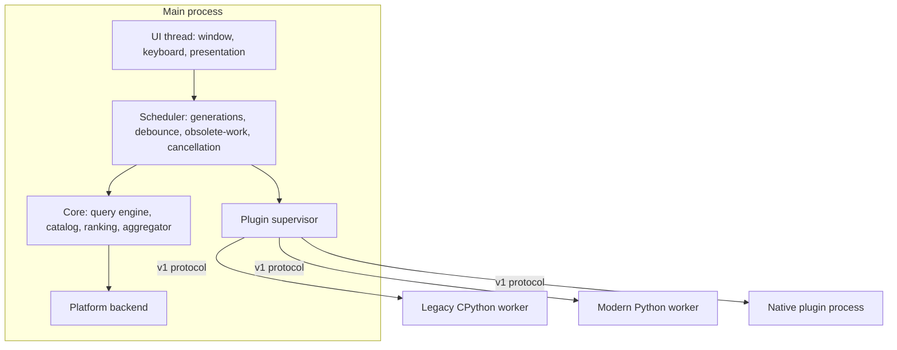
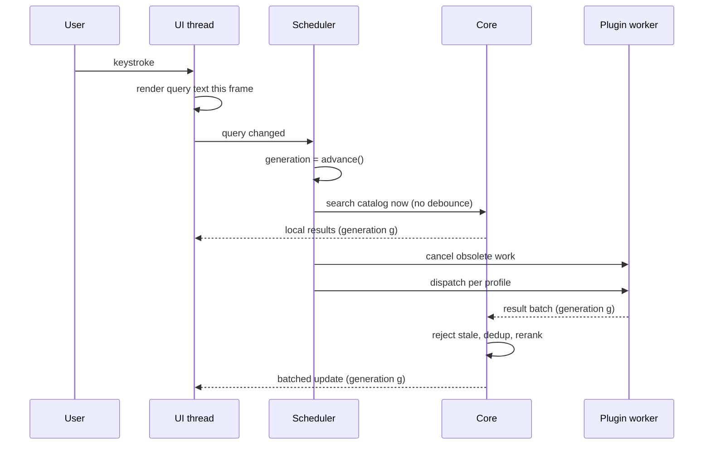

# CriKey architecture

Companion to [`docs/spec/crikey-spec-v1.md`](spec/crikey-spec-v1.md) §5. This
document describes how the specification's logical components map onto crates,
processes and threads.

## Processes

The main process owns the window, keyboard input, query state, generation ids,
catalog indexes, ranking, history, supervision and platform services. No
third-party code runs inside it.

## Threads inside the main process

| Thread | Work | Blocking rules |
| --- | --- | --- |
| UI | winit event loop, input, presentation | Never blocks; only reads a prepared view model |
| Scheduler | generation allocation, debounce timers, dispatch decisions | Pure decisions plus channel sends; no I/O |
| Core pool | matching, ranking, aggregation, catalog updates | CPU bound, bounded parallelism |
| Async runtime | IPC, process supervision, filesystem watching, package management | I/O bound; never touches the UI thread directly |

## Query pipeline

Local catalog search is never debounced. Plugin dispatch is: modern plugins by
manifest policy, legacy plugins by prompt dispatch plus obsolete-work
replacement.

## Scheduling contracts side by side

| | `legacy-strict` | `modern` |
| --- | --- | --- |
| Time debounce | Never | Manifest policy, leading/trailing/max-wait |
| Initial dispatch | Broadcast to all loaded legacy plugins | Gated by declared activation metadata |
| Concurrency | Serial per plugin instance | `serial`, `concurrent_queries` or `fully_concurrent` |
| Obsolete in-flight work | `should_terminate()` becomes true | Cancellation token or message |
| Pending queries | Newest pending request replaces older ones | Coalesced to newest |
| Stale results | Rejected | Rejected |
| Dynamic result cache | Disabled | Declared cache policy |
| Minimum query length / prefix gating | Never host-imposed | Manifest declared |
| Hard deadline | None; long watchdog for hung workers only | 500 ms default |

## Dependency rules

- `crikey-core` depends on nothing in the workspace.
- Platform-independent crates never depend on `crikey-platform-*`.
- Only `crikey-app` selects a backend, through `cfg` target dependencies.
- `crikey-legacy-compat` depends on `crikey-python-host`, never the reverse.
- The SDKs (`sdk/rust`, `sdk/python`) depend on the protocol, never on host crates.

## Backpressure and bounds

Every hop is bounded with a named overflow policy:

| Queue | Bound | Overflow policy |
| --- | --- | --- |
| Pending query per modern plugin | 1 | Replace with newest |
| Pending query per legacy plugin | 1 | Replace with newest, keep running callback |
| Inbound result batches per plugin | capacity `N` | Pause reads, then reject low-priority batches |
| Aggregated items per plugin per query | manifest quota | Reject with `QuotaExceeded` |
| UI updates | display refresh | Coalesce into the next frame |
