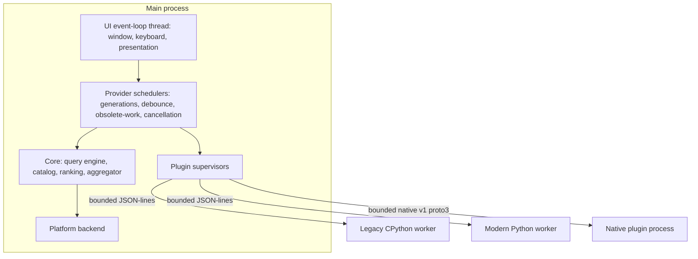
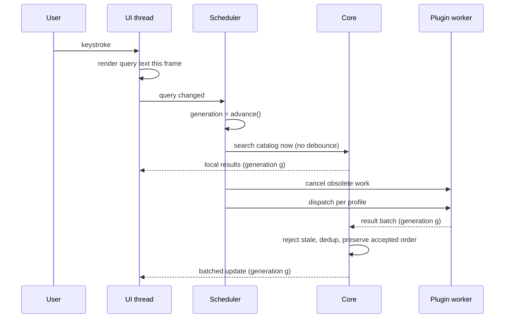

# CriKey architecture

Companion to [`docs/spec/crikey-spec-v1.md`](spec/crikey-spec-v1.md) §5. This
document describes how the specification's logical components map onto crates,
processes and threads. For the mechanics of building and testing the tree, see
[`docs/development.md`](development.md).

## Processes

The main process owns the launcher window, keyboard input, local catalog
indexes, ranking, platform services, and the provider drivers. Ranking history
is durable: `SelectionHistoryStore` is restored before queries are accepted and
each selection is persisted, while the foreground-window context signal remains
platform-dependent. Each provider driver owns a query pipeline and its own current generation;
the provider generations are advanced in step with the launcher query. No
third-party code runs inside the main process.

The native worker uses the versioned proto3 protocol. The legacy and modern
Python workers currently use separate bounded newline-delimited JSON protocols;
they do not speak the native proto3 wire format.

On Linux every one of those three worker processes is Landlock-confined before
it executes (ADR-0019): it may write only beneath the directories the host
named for it, and a plugin without the `network` grant cannot `bind` or
`connect` a TCP socket. Reads, execution and syscalls generally are not
restricted, and Windows and macOS install no equivalent, so the process
boundary above remains the primary isolation everywhere.

## Threads inside the main process

| Thread | Work | Blocking rules |
| --- | --- | --- |
| UI event loop | winit event loop, input, immediate local catalog search, and presentation | Never waits for plugin I/O or a child process; small in-process Rust work may run in the event callback |
| Provider supervisor threads | `LegacyDriver`, `ModernDriver`, and `NativeDriver`; each owns its `QueryPipeline`, scheduling decisions, result aggregation, and worker dispatch | Blocking child I/O stays off the UI thread; request slots and result intake are bounded |
| Provider dispatch threads | Modern/native catalog builds and native per-plugin calls where the provider needs parallel work | Work is cancellable or joined during shutdown; no provider thread blocks the UI event loop |

There is no standalone Tokio runtime or general shared CPU pool in the current
implementation. Scheduling is a deterministic state machine driven by the
provider supervisor thread with caller-supplied millisecond timestamps; the
driver's bounded mailbox and condition variable provide the waiting outside
that state machine.

## Query pipeline

Local catalog search is never debounced. Plugin dispatch is: modern plugins by
manifest policy, legacy plugins by prompt dispatch plus obsolete-work
replacement.

### Two paths, two matching contracts

Text matching does **not** apply uniformly to everything the user sees. Which
path an item arrives on decides whether the host matches it at all:

| Path | Who produces it | Host matching |
| --- | --- | --- |
| Catalog search | `SearchService` over the built-in catalog | **Fuzzy matching.** Host-side `DefaultMatcher` filters and scores catalog rows before presentation |
| Suggestion batch | A plugin's `on_suggest` / `suggest`, legacy or modern | **None.** The batch is delivered as the plugin published it; `QueryPipeline` preserves first-acceptance order and replaces enrichment updates in place |

`DefaultMatcher` is owned by `SearchService` and is reachable from nowhere
else, so fuzzy matching is a property of catalog search, not of the result list
in general. A plugin that wants its suggestions filtered against the query
filters them itself — the host will not do it, and a plugin that publishes a
broad list gets that list shown.
Plugin suggestion batches therefore do not receive host-side text matching or
ranking. `score_hint` is carried on the item model, but the current result
aggregator does not sort plugin batches by it. Legacy decoding assigns
`score_hint: 0`, so legacy publication order is preserved; modern plugins'
score hints are likewise not yet consumed at this boundary.

This is why `keypirinha.Match` and `keypirinha.Sort` are recorded as `partial`
in the API matrix: a legacy plugin can request a matching or sort policy, but
there is no host-side stage on this path to apply it. A future change that
consumes score hints or applies those policies must add an explicit aggregation
stage rather than relying on incidental arrival order.

## Scheduling contracts side by side

| | `legacy-strict` | `modern` |
| --- | --- | --- |
| Time debounce | Never | Manifest policy, leading/trailing/max-wait |
| Initial dispatch | Broadcast to all loaded legacy plugins | Gated by declared activation metadata |
| Concurrency | Serial per plugin instance | Bounded by manifest `max-concurrent-requests` (default one) |
| Obsolete in-flight work | `should_terminate()` becomes true | Cancellation token or message |
| Pending queries | Newest pending request replaces older ones | Coalesced to newest |
| Stale results | Rejected | Rejected |
| Dynamic result cache | Disabled | Declared cache policy |
| Minimum query length / prefix gating | Never host-imposed | Manifest declared |
| Hard deadline | None; long watchdog for hung workers only | 500 ms default |

## Dependency rules

- `crikey-core` depends on nothing in the workspace.
- Platform-independent crates never depend on `crikey-platform-*`.
- Only `crikey-app` selects a backend, through `cfg` target dependencies.
- `crikey-legacy-compat` depends on `crikey-python-host`, never the reverse.
- The official Rust SDK (`sdk/rust`) depends on the native protocol and core
  model; the Python SDK (`sdk/python`) is a standalone Python API and does not
  import host crates.

## Backpressure and bounds

Every hop is bounded with a named overflow policy:

| Queue | Bound | Overflow policy |
| --- | --- | --- |
| Pending query per modern plugin | 1 | Replace with newest |
| Pending query per legacy plugin | 1 | Replace with newest, keep running callback |
| Inbound result batches per plugin | capacity `N` | Configured pause, replacement, rejection, or disconnect policy |
| Aggregated items per plugin per query | configured result limit | Reject with `QuotaExceeded` |
| UI updates | display refresh | Coalesce into the next frame |
