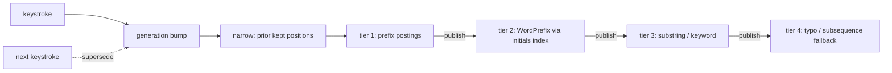

# Fuzzy matching review: why "manic" finds "Memory Diagnostic Tool"

Research note. No code changed. All numbers below were measured against the
current tree (`996db39`, 0.1.7) with throwaway probes; the Python prototypes
reproduce the Rust matcher bit-for-bit on every case shown.

---

## 1. What the matcher does today

`crates/crikey-query/src/lib.rs`. One token is credited with the strongest of
six interpretations, and the outcome takes the **weakest** method over all
tokens (`score_prepared`, lib.rs:692-710). Each method owns a disjoint score
band (`band`, lib.rs:584-593):

| method | band |
| --- | --- |
| ExactPrefix | 0.90 – 1.00 |
| Prefix | 0.75 – 0.88 |
| Substring | 0.58 – 0.72 |
| Acronym | 0.42 – 0.55 |
| Keyword | 0.26 – 0.39 |
| Fuzzy | 0.10 – 0.23 |

`fuzzy_quality` (lib.rs:889-931) is the last resort:

```rust
// greedy leftmost subsequence scan
let compactness = ratio(matched, (last_ordinal - first_ordinal).saturating_add(1));
let earliness   = 1.0 / first_ordinal.saturating_add(1) as f32;
Some(0.5 * compactness + 0.5 * earliness)
```

Three properties matter, and all three are the bug:

1. **Any subsequence is accepted.** There is no floor, no density
   requirement, no minimum token length beyond 2 chars. If the characters
   occur in order, the item is a result.
2. **The alignment is greedy-leftmost, not optimal.** The first occurrence of
   each character wins even when a later occurrence sits on a word boundary
   and would read as intentional.
3. **The quality term is nearly blind.** `earliness` is worth half the score
   and only looks at the *first* matched character; `compactness` is a crude
   span ratio. Nothing in the formula knows what a word is.

## 2. The measurement: the good case and the bad case are the same case

Real output from `DefaultMatcher::match_item` over a 20-item app catalog:

```
=== query "manic" -> 2 hits
  0.1853  Fuzzy        Manage Windows Credentials
  0.1841  Fuzzy        Memory Diagnostic Tool

=== query "vscode" -> 1 hits
  0.1867  Fuzzy        Visual Studio Code
```

The within-band quality terms are `0.6667` (vscode → Visual Studio Code),
`0.6562` (manic → Manage Windows Credentials) and `0.6471` (manic → Memory
Diagnostic Tool). **The match you like and the match you hate are 1.5% apart
in the current model.**

On these three rows alone a cutoff at ~0.661 would in fact separate them. That
is an artifact of a three-row sample. Widening the probe to 16 labelled pairs
over the same catalog collapses the idea entirely — the two classes do not
merely sit close, they **interleave**:

```
0.7500  WANT  gochr   Google Chrome
0.7500  DROP  sc      Slack                          <- exact tie with a WANT
0.7500  DROP  ie      IntelliJ IDEA                  <- exact tie with a WANT
0.7273  WANT  reged   Registry Editor
0.7143  WANT  fex     File Explorer
0.7143  WANT  cmd     Command Prompt
0.6667  WANT  vscode  Visual Studio Code
0.6667  DROP  set     Sublime Text                   <- exact tie with vscode
0.6562  DROP  manic   Manage Windows Credentials
0.6471  DROP  manic   Memory Diagnostic Tool
0.6071  WANT  wps     Windows PowerShell
0.5882  DROP  mmc     Memory Diagnostic Tool
0.5000  DROP  tm      Steam
0.4556  DROP  code    Sound Recorder
0.2698  WANT  psh     Windows PowerShell
0.1883  DROP  gc      Memory Diagnostic Tool

worst WANT = 0.2698   best DROP = 0.7500   separable = False
24 (WANT, DROP) pairs are inverted or tied.
```

`sc` → *Slack* scores **exactly** as well as `gochr` → *Google Chrome*, and
`set` → *Sublime Text* scores **exactly** as well as `vscode` → *Visual Studio
Code*. Exact ties are the decisive form of this argument: no threshold, and no
monotone rescaling of the existing quality function, can put a tied pair on
opposite sides of a line. The ordering itself is wrong, not its calibration.

That kills an entire family of "solutions": tuning weights, adding a score
cutoff, or shrinking the Fuzzy band cannot work, because they all preserve the
order above. The quality function has to be replaced, not calibrated.

Caveat on the evidence: these 16 pairs are my own labels over a 37-item
synthetic catalog, not a measured corpus. They are sufficient to *refute*
separability — one tie does that — but the positive claims in §4 about recall
are only as good as this sample, and should be re-measured against a real
catalog with real query logs before the tuning constants are frozen.

More collateral from the same probe:

```
=== query "sc" -> 9 hits
  0.6233  Substring    Discord            <- outranks the real acronym
  0.5500  Acronym      System Configuration
  0.1794  Fuzzy        Sound Recorder
  0.1542  Fuzzy        Disk Cleanup
  0.1480  Fuzzy        Manage Windows Credentials
  0.1371  Fuzzy        Memory Diagnostic Tool
  0.1317  Fuzzy        Visual Studio Code
  0.1251  Fuzzy        Remote Desktop Connection
  0.1185  Fuzzy        Microsoft Management Console

=== query "code" -> 2 hits
  0.6002  Substring    Visual Studio Code
  0.1592  Fuzzy        Sound Recorder     <- "s-o-und re-c-or-d-e-r"
```

Two secondary complaints fall out: `sc` inside *Discord* beats the genuine
initialism *System Configuration* because Substring outranks Acronym as a
band; and 7 of 9 hits for a 2-char query are noise.

### 2a. The noise is not harmless — it can win the ranking

`W_MATCH_QUALITY` is 1.0 and the Fuzzy band is only 0.13 wide, while the
history signals are worth up to `W_FREQUENCY + W_RECENCY + W_QUERY_HISTORY =
0.75` (`crates/crikey-ranking/src/lib.rs:27-46`). Measured with
`DefaultRanker`, history enabled:

```
query "man"
  fresh Prefix match "Manager"                        -> Score(1.0757)
  habituated Fuzzy match "Memory Diagnostic Tool"     -> Score(1.1495)   INVERTED
```

That probe used 40 selections, 10 minutes old, query affinity 1.0. Sweeping
for the *minimum* history that inverts pins down how narrow the window
actually is:

```
fresh prefix baseline: Score(1.0757)
affinity=0  age=10min  -> never inverts (swept to 100k selections)
affinity=0  age=1day   -> never inverts
affinity=0  age=7day   -> never inverts
affinity=0  age=30day  -> never inverts
affinity=1  age=10min  -> inverts at 12 selections
affinity=1  age=1day   -> inverts at 4473 selections
affinity=1  age=7day   -> never inverts
affinity=1  age=30day  -> never inverts
```

So the accurate claim is narrower than "one accidental click sticks forever":

* Frequency and recency **alone never invert it**, at any selection count.
  `W_FREQUENCY` and `W_RECENCY` saturate (`saturating_rise`,
  `saturating_decay`) below the 0.62 band gap.
* Inversion requires `query_history = 1.0` — prior selections **for this exact
  query** — plus recent activity. It is a feedback loop, not a stray click: the
  user has to have picked the junk hit for *this* query before.
* It decays. At `W_RECENCY`'s one-day half-life the bar jumps from 12
  selections to 4473, and by 7 days it cannot invert at all. Clearing history
  resets it.

A junk fuzzy hit can therefore outrank an exact prefix match **while its
query-specific history stays strong**, and the loop is self-reinforcing while
it lasts. That is a smaller bug than the first probe implied, but it is still
the argument for not feeding the history signals garbage in the first place —
and note it is `query_history`, the one signal a bad match earns fastest,
that does the damage.

Note also `DefaultRanker::non_prefix_upper_bound` (ranking/lib.rs:456-469)
hard-codes `match_quality: 0.72` — the Substring ceiling. Any new tier
inserted above Substring must update that constant or bounded selection will
prune valid candidates.

---

## 3. What the field does

| system | mechanism | verified source |
| --- | --- | --- |
| **fzf v2** | Smith-Waterman-style DP, optimal alignment. `scoreMatch=16`, `scoreGapStart=-3`, `scoreGapExtension=-1`, `bonusBoundary=8`, `bonusNonWord=8`, `bonusCamel123=7`, `bonusConsecutive=4`, `bonusFirstCharMultiplier=2`, `bonusBoundaryWhite=10`, `bonusBoundaryDelimiter=9`. Falls back to greedy V1 above the slab cap or pattern length 1000. **No acceptance threshold** — if a subsequence exists, it scores. | `src/algo/algo.go:112-153`, DP at 878-910 |
| **fzy** | Same shape, float weights: `SCORE_MATCH_CONSECUTIVE=1.0`, `SLASH=0.9`, `WORD=0.8`, `CAPITAL=0.7`, `DOT=0.6`, `SCORE_GAP_LEADING=-0.005`, `TRAILING=-0.005`, `INNER=-0.01`. `MATCH_MAX_LEN=1024`. Also no acceptance threshold. | `src/config.def.h:7-14`, `src/match.c:74-143` |
| **Nucleo** | fzf constants re-implemented in Rust with Unicode normalization, a reusable slab (no per-call allocation), a memchr prefilter that bounds the DP window, and greedy fallback for large inputs. Query words are separate *atoms* ANDed together (`Pattern::score` returns `None` if any atom fails) — same policy CriKey already has. | `matcher/src/score.rs:6-36`, `prefilter.rs:25-67`, `fuzzy_optimal.rs:12-108`, `pattern.rs:402-497` |
| **skim** | fzf constants with `bonus_camel=6`, `bonus_break=7`, case-mismatch `-2`; cheap greedy subsequence prefilter before the DP. | `src/fuzzy_matcher/skim.rs:29-97, 451+` |
| **VS Code** | *Different family.* `matchesCamelCase` walks explicit **anchors** (uppercase, digits, or the char after a non-alphanumeric) and only matches at those anchors. `matchesWords` requires each char at a word start. `fuzzyScore` runs a bounded DP (128×128) and **returns `undefined` when the first match is weak** unless `firstMatchCanBeWeak` is set. Bonus table: start-of-word `+8`, after separator `+5`, inside-uppercase `+2`, consecutive `+1`; first non-start match penalised `-3`/`-5`. | `src/vs/base/common/filters.ts:204-289, 292-442, 760-951`; `fuzzyScorer.ts:216-240` |
| **TextMate** | Rejects non-subsequences, then scores by contiguous runs and how many query chars land on "capitals" (word beginnings). Full credit only when *every* query char touches a beginning. | `Frameworks/text/src/ranker.cc:4-189` |
| **Command-T** | fzf-shaped: `BONUS_CAMEL=0.8`, `SLASH=0.9`, `WORD=0.8`, `DOT=0.7`, `CONSECUTIVE=1.3`, interior gap decay `0.75/distance`, work cap 16384 cells then greedy fallback. | `score.c` |

The split is the important part. **fzf/fzy/nucleo/skim rank; they do not
filter.** They are interactive filters over a list the user is already staring
at, where a bad match at the bottom costs nothing. A launcher shows 8 rows and
must *reject*. VS Code and TextMate, which have the same constraint, are the
ones with explicit rejection gates (`firstMatchCanBeWeak`, "all query chars
touch capitals").

**Typo tolerance is a separate axis** and none of the above handles it.
Bounded Levenshtein (`levenshtein_less_equal(a, b, max_d)`, PostgreSQL
`fuzzystrmatch`), trigram similarity (`pg_trgm`, default thresholds
`similarity ≥ 0.3`, `word_similarity ≥ 0.6`, `strict_word_similarity ≥ 0.5`)
and Jaro-Winkler (Winkler boost only when `j ≥ 0.7`, prefix capped at 4) all
model *edits*, not *abbreviation*. They are the right tool for `asudio` →
*Android Studio* and completely the wrong tool for `vscode` → *Visual Studio
Code*. Do not conflate the two.

---

## 4. Solutions

### Option A — Word-prefix decomposition (recommended)

**Rule.** A token matches iff it can be partitioned into consecutive chunks
`c₁…cₖ` such that each `cᵢ` is a **prefix of a distinct word** of the label,
and the words are used in increasing order. Words are alnum runs, further split
on camelCase and letter→digit transitions.

This is exactly the discriminator you described in words:

```
vscode / Visual Studio Code    -> ["v", "s", "code"]   ACCEPT
manic  / Memory Diagnostic ... -> no partition exists  REJECT   (the "a" is mid-word)
manic  / Manage Windows Cred.  -> no partition exists  REJECT   ("man" then "i" mid-word)
code   / Sound Recorder        -> no partition exists  REJECT
```

It subsumes acronym matching (every chunk length 1 = today's `Acronym`) and
generalises it, which is the thing today's `acronym_quality` (lib.rs:856-886)
can't do: it demands *strictly* the leading initials, so `cmd`, `psh`, `reged`
and `gochr` all fall through to Fuzzy today.

Measured on a 37-item catalog, prototype quality
`0.30·word_coverage + 0.25·char_coverage + 0.15·starts_at_first_word +
0.15·words_contiguous + 0.15·full_word_chunks`:

| query | label | want | today | decomposition |
| --- | --- | --- | --- | --- |
| vscode | Visual Studio Code | keep | 0.187 Fuzzy | **0.744** `[v][s][code]` |
| gochr | Google Chrome | keep | 0.198 Fuzzy | **0.704** `[go][chr]` |
| reged | Registry Editor | keep | 0.195 Fuzzy | **0.689** `[reg][ed]` |
| tm | Task Manager | keep | 0.550 Acronym | **0.645** `[t][m]` |
| wps | Windows PowerShell | keep | 0.179 Fuzzy | **0.644** `[w][p][s]` |
| mmc | Microsoft Management Console | keep | 0.550 Acronym | **0.629** `[m][m][c]` |
| psh | Windows PowerShell | keep | 0.135 Fuzzy | **0.394** `[p][sh]` |
| manic | Memory Diagnostic Tool | drop | 0.184 Fuzzy | **reject** |
| manic | Manage Windows Credentials | drop | 0.185 Fuzzy | **reject** |
| mmc | Memory Diagnostic Tool | drop | 0.176 Fuzzy | **reject** |
| sc | Slack | drop | 0.198 Fuzzy | **reject** |
| code | Sound Recorder | drop | 0.159 Fuzzy | **reject** |
| gc | Memory Diagnostic Tool | drop | 0.124 Fuzzy | **reject** |
| asudio | Android Studio | typo | 0.193 Fuzzy | reject → see Option D |

Catalog-wide hit counts, current vs decomposition:

```
query    cur  decomp   top-3 today                                     top-3 proposed
manic      2       0   Manage Windows Credentials, Memory Diagnostic   —
vscode     1       1   Visual Studio Code                              Visual Studio Code
sc        11       3   Discord, System Configuration, Slack            Discord, System Configuration, Visual Studio Code
gc         4       1   Google Chrome, Memory Diagnostic, Microsoft...  Google Chrome
tm         6       1   Task Manager, Steam, System Configuration       Task Manager
dm         4       1   Device Manager, Windows Media Player, Comm...   Device Manager
ie        15       1   Event Viewer, IntelliJ IDEA, File Explorer      Event Viewer
st        17       9   Steam, System Configuration, Registry Editor    Steam, System Configuration, Registry Editor
set        8       1   Settings, Sublime Text, System Configuration    Settings
code       2       1   Visual Studio Code, Sound Recorder              Visual Studio Code
```

Implementation: a DP over `(word_index, query_offset)`, `O(W · m · L)` where
`W` = words in the label, `m` = token length, `L` = longest word. Measured at
**57.3 ns per candidate versus 26.0 ns** for today's scan — 2.2× per candidate.
With the recall-safe bigram gate of §6.1 the tier's added cost is **0.86 ms per
token** at 500k items (1.86 ms with only the weak first-initial gate, 6.8 ms
ungated). It also needs a hard work cap that *skips* rather than truncates, and
word boundaries precomputed from the raw label. There is no sound `O(words)`
shortcut for short tokens — see §6.1. Do not take the asymptotics on faith; the
constants, the gate, and its scoping are what decide this.

**Recall cost.** `ss` → *Settings* and `cmd` → *Command Prompt* are rejected:
neither has a legal partition. That is the correct call for the matcher —
`cmd` is an *alias*, not an abbreviation of the label, and belongs in
`Item::search_terms`, which already routes to the Keyword band
(`keyword_quality`, lib.rs:934-955). Worth auditing the apps plugin for
missing aliases as part of this change. Where recall genuinely matters, pair
with Option C.

### Option B — fzf-style optimal DP with boundary bonuses

Replace the greedy scan with an optimal alignment carrying fzf's bonus model.
Prototype run over the same 16 labelled pairs as §2, normalised as
`raw / (16 + 8·2 + (m−1)·(16 + 4))`:

```
0.9732  WANT  gochr   Google Chrome
0.9722  WANT  fex     File Explorer
0.9643  WANT  reged   Registry Editor
0.9583  WANT  psh     Windows PowerShell
0.9394  WANT  vscode  Visual Studio Code
0.8889  WANT  wps     Windows PowerShell
0.8661  DROP  manic   Manage Windows Credentials
0.8654  DROP  ie      IntelliJ IDEA
0.8611  DROP  set     Sublime Text
0.8462  DROP  sc      Slack
0.7778  WANT  cmd     Command Prompt                 <- the sole inversion
0.7500  DROP  code    Sound Recorder
0.7321  DROP  manic   Memory Diagnostic Tool
0.6389  DROP  mmc     Memory Diagnostic Tool
0.5385  DROP  tm      Steam
0.4808  DROP  gc      Memory Diagnostic Tool

worst WANT = 0.7778   best DROP = 0.8661   separable = False (4 inverted pairs)
```

This is a large improvement on §2, and more honest than "it doesn't work":
every inversion traces to the single pair `cmd` → *Command Prompt*. Drop that
one — and `cmd` is an **alias**, not an abbreviation of the label, so it
belongs in `Item::search_terms` and the Keyword band regardless — and the
remaining 15 pairs *are* separable by a cutoff at ≈0.87.

So a threshold on an fzf-style score is viable, with two caveats that decide
against making it the primary mechanism:

* **The margin is 2.3%** (0.8889 worst WANT vs 0.8661 best DROP), calibrated
  on 15 hand-labelled pairs from a synthetic catalog. That is a tuning
  constant with no corpus behind it, and it moves with label length, word
  count and locale. Option A needs no such constant — it rejects on structure.
* **The failures are silent and unbounded.** A threshold that drifts admits
  noise back with no signal that it happened; a structural rule either finds a
  legal partition or does not.

There is also a trap worth calling out. Gating fzf's *score-optimal* alignment
on "every run starts at a word boundary" is wrong: for `mmc` → *Microsoft
Management Console*, the DP's highest-scoring alignment is `[10, 16, 21]`
(`M`anagement, `m` inside "Manage**m**ent", `C`onsole) at 59 points, beating
the semantically correct `[0, 10, 21]` at 57, because gap extension punishes
the long leading gap. The boundary gate then rejects a match it should keep.
If you want a boundary constraint, you must **search for the best legal
alignment** (Option A's DP), not filter the unconstrained optimum.

Option B is still worth taking — as the *within-band ordering* function for
whatever the structural tiers admit, and for path-like targets where word
decomposition is weak. Nucleo (`nucleo-matcher`, fzf constants, Unicode-aware,
reusable slab, no allocation per call) is a drop-in-quality reference here —
CriKey already does its own
Unicode folding and prefilter, so a port of `fuzzy_optimal.rs`'s recurrence is
the realistic route rather than a dependency.

### Option C — Tiered fallback (recall insurance)

Keep unconstrained subsequence matching, but only fire it when the strict
tiers return **nothing**. Two-pass: run prefix/substring/decomposition/keyword
first; if the result set for the generation is empty, re-run with the loose
tier admitted, and mark those rows visually distinct. This recovers `ss` →
*Settings* and `manic` → *Memory Diagnostic Tool* for the user who genuinely
wanted it, at zero cost to the common case. Cheap to build on top of A, and it
makes A's rejection rule safe to be aggressive.

Interacts with `SearchService`'s bounded selection (`app/src/lib.rs:570-597`,
`PluginSelection::consider`): the second pass needs the candidate set from the
catalog prefilter, which is already available via the presence mask
(`crikey-catalog/src/lib.rs:651-700`), so the re-run is a rescan, not a
re-index.

### Option D — Typo tolerance as a distinct, bounded tier

`asudio` → *Android Studio* is one transposition-ish edit and no
subsequence/decomposition scheme will ever catch it. Handle it with a bounded
edit-distance tier at the *word* level, not the label level: for each label
word, accept if `damerau_levenshtein(chunk, word) ≤ max(1, len/5)`, with the
distance computed under a bound (`levenshtein_less_equal` semantics) so the DP
early-exits. Band it *below* Keyword and require `token_chars ≥ 4` so short
tokens can't fuzz into everything. Do **not** use whole-string Jaro-Winkler or
trigram similarity: with a 6-char query and an 18-char label they measure
length disagreement, not typos.

### Option E — Cheap hygiene fixes (independent of A–D)

Small, uncontroversial, each measurable on its own:

1. **Short tokens still need the real DP.** A ≤3-character token can use a
   multi-character chunk (`so` → *Sound Recorder* is `["so"]`), so there is no
   sound `O(words)` shortcut — see §6.1. Short tokens are nonetheless
   intrinsically cheap, because the grid is `(W+1) × (m+1)`. What they do need is
   the recall-safe first-initial gate: 2-char tokens are exactly the cases that
   enter the tier ~119,000 times per keystroke on a 500k catalog. Today
   `fuzzy_quality` admits 2-char tokens (lib.rs:895-898) and `sc` produced 9
   hits over 20 items.
2. **Order Acronym above Substring.** `sc` → *Discord* (Substring, 0.623)
   currently beats `sc` → *System Configuration* (Acronym, 0.550). Swapping
   the two bands in `band()`/`precedence()` is a one-line change, but note
   `review_regressions.rs:252-285`
   (`score_bands_enforce_full_declared_precedence`) and
   `query_behavior.rs`'s `precedence_prefix_over_substring_over_fuzzy` lock the
   current order.
3. **Cap the loose tier's ranking influence.** Even with A in place, consider
   scaling the history terms by match quality, or floor-gating them. Per §2a
   the specific culprit is `query_history` (`W_QUERY_HISTORY`), not frequency
   or recency — those saturate below the band gap and never invert on their
   own — so gating that one term is the targeted fix.
4. **Re-check `non_prefix_upper_bound`'s hard-coded `0.72`**
   (ranking/lib.rs:458) against any new band layout.

---

## 5. Recommendation

Ship **A + C + E1/E2**, and treat **B** as the within-band scorer and **D** as
a later, separately-banded tier.

To be explicit about the close call: **B alone would also fix your two
examples**, and on the 16-pair probe it separates all but the `cmd` alias case
with a cutoff near 0.87. I still recommend A over B as the *admission* rule
because A rejects on structure and B rejects on a hand-calibrated constant
with a 2.3% margin and no corpus behind it. If a labelled query corpus later
shows that constant is stable on real data, B-with-a-threshold is a
materially smaller change than A and a legitimate alternative — that is the
measurement that should decide it, not this note.

Proposed band layout. **Adjacent bands must stay at least 0.02 apart**: that is
the gap `crikey-ranking`'s `W_MATCH_POSITION = 0.02` is calibrated against
(`ranking/src/lib.rs:30-32`), and a narrower one lets the match-position bonus
carry a weaker method past a stronger one. An earlier draft of this table used
0.01 gaps and did exactly that — caught by
`query_method_bands_outrank_the_largest_position_advantage` during
implementation, which is the test that encodes the invariant.

| method | band | note |
| --- | --- | --- |
| ExactPrefix | 0.90 – 1.00 | unchanged |
| Prefix | 0.75 – 0.88 | unchanged |
| WordPrefix (new) | 0.60 – 0.73 | subsumes and replaces `Acronym` |
| Substring | 0.45 – 0.58 | demoted below WordPrefix (E2) |
| Keyword | 0.30 – 0.43 | unchanged in spirit |
| Fuzzy (opt-in) | 0.05 – 0.17 | ordered subsequence, off by default |

A typo tier (Option D) is **not** in this layout: the catalog prefilter
(`presence_mask` plus `ordered_pair_signature`) requires every token character
to occur in the item *in order*, which a typo violates — `noteapd` against
`Notepad` needs the pair `(a,p)` while the label has `p` before `a`. Adding
edit-distance matching therefore means adding an index that tolerates edits, not
just a scoring method. Discovered while implementing; see §6.1.

With these measured constants for the `WordPrefix` tier:

| constant | value | why |
| --- | --- | --- |
| `MAX_WORDS` | 8 | 645 ns worst case; real app labels are 2–4 words |
| `MAX_TOKEN` | 12 chars | over-cap ⇒ **decline the tier**, never truncate |
| gate | word-initials mask | recall-safe seed filter; 12–15× on some queries, 1× on others |
| grid | caller-owned | per-call allocation costs 8× the algorithm |

Spec impact is nil: `docs/spec/crikey-spec-v1.md:678-693` requires prefix,
substring, fuzzy, acronym and keyword matching to *exist*; it fixes neither
their precedence nor their admission rules. `MatchMethod` has no consumers
outside `crikey-query`, `crikey-ranking` and `crikey-app`'s `SearchHit` — the
UI only consumes highlight ranges (`app/src/lib.rs:1206-1232`,
`ui/src/native.rs:2181-2204`), so adding or renaming variants is contained.

### Blast radius

- `crates/crikey-query/src/lib.rs`: `band`, `MatchMethod::precedence`,
  `match_label`, `acronym_quality`, `fuzzy_quality`, plus a new decomposition
  DP and a word-splitter (`word_initials`, lib.rs:962-978, is the seed — it
  needs camelCase and letter→digit splits added, run on the **raw** label).
- `PreparedLabel` (query/lib.rs:356-364) grows two precomputed fields: word
  boundaries in normalized space, and a 64-bit word-initials mask. Both are the
  gate that keeps the DP off the hot path, so neither is optional.
- The DP needs a caller-owned scratch grid threaded like the existing
  `spans: &mut Vec<(usize, usize)>`; a per-call allocation costs 8× the
  algorithm itself (measured).
- `crates/crikey-ranking/src/lib.rs:456-469`: `non_prefix_upper_bound`'s
  `0.72` constant.
- `crates/crikey-app/src/lib.rs:570-597, 1134-1175`: the only production
  caller of the matcher; needs the second pass if Option C lands.
- `benchmarks/src/lib.rs:429-431`: `benchmark_query` must gain a non-prefix
  query mode, or the 500k harness will keep reporting numbers that never
  execute this code.
- `crikey-catalog` `SCHEMA_VERSION` (currently 1, asserted in
  `benchmarks/src/lib.rs:82-85`): a bump only if the new boundary data is
  persisted in the cached slice rather than recomputed on load.
- Tests that will need re-baselining: `query_behavior.rs`
  (`acronym_match_uses_word_initials`, `precedence_prefix_over_substring_over_fuzzy`,
  `fuzzy_match_requires_ordered_characters`), `review_regressions.rs:252-285`,
  `ranking_behavior.rs:684-707`.

### Performance (measured)

Budget: 500k catalog items, <16 ms p95 for all of `submit_query`
(`docs/ROADMAP.md:84-86`, currently measured at 13.099 ms). My first estimate
here was "[INFERENCE] likely a wash". That was wrong in both directions, so
everything below is measured.

**The existing 500k harness cannot measure this change.** `benchmark_query`
(`benchmarks/src/lib.rs:429-431`) returns a complete synthetic label and
`query_phase` submits its character prefixes, so every keystroke returns at the
global-prefix fast path (`query/src/lib.rs:672-682`) and never reaches
`match_token`. Any 500k number from today's harness is infrastructure baseline,
not evidence about this tier. Landing this change requires adding a non-prefix
query mode to the harness.

**Per-candidate cost.** Allocation-free prototype (caller-owned grid, byte
comparison, longest-common-prefix computed once per (word, offset) instead of
per chunk length), release build:

```
realistic x5: decompose_quality      286.3 ns/call   ->  57.3 ns per candidate
realistic x5: fuzzy_quality (today)  130.2 ns/call   ->  26.0 ns per candidate
                                                          2.2x slower
```

A first prototype that collected a `Vec<char>` per word per call measured
465 ns/candidate — 19×. The algorithm is not the cost; allocation is. Any
implementation must take the grid from the caller, exactly as `score_prepared`
already threads `spans: &mut Vec<(usize, usize)>`.

**How often the tier is entered — the number that actually matters.** The
admission predicate has to be the *proposed* one, not today's. In the layout
above, `WordPrefix` sits **before** `Substring`, so the DP runs on every
candidate that passes the presence mask and fails the two prefix checks. That
includes candidates which today match as Substring, Acronym, Keyword or Fuzzy,
*and* candidates which today do not match at all. Measured on 500k items with
non-prefix queries:

```
 query  len      mask  entersWP afterGate  fastpth    cut%  todayMs   propMs
    ab    2    117500    117500         0    10000    91.5     1.92     0.10
    ke    2     50000     50000         0    20000    60.0     0.46     0.20
  sole    4     81250     81250     15000        0    81.5     0.36     0.86
   mgr    3     41250     41250         0    35000    15.2     0.94     0.35
    ec    2    190000    190000         0    15000    92.1     2.15     0.15
    zt    2     26250     26250         0     6250    76.2     0.29     0.06
    qm    2      5000      5000         0     5000     0.0     0.07     0.05
   rvr    3     65000     65000         0    21250    67.3     0.52     0.21
  kntc    4     22500     22500     20000        0    11.1     0.52     1.15
  mnbk    4      5000      5000      1250        0    75.0     0.13     0.07
   xnn    3     28750     28750         0    20000    30.4     0.52     0.20
   ylw    3     21250     21250         0    20000     5.9     0.52     0.20

worst single-token: today 2.15 ms, proposed 1.15 ms
```

Up to **190,000 candidates per keystroke** enter the tier for a 2-char query by
the presence mask alone — **118,750** through the product's real indexed path
(§6 corrects this; the figures in this table are mask-only and so pessimistic).
Running the DP on all of them at 57.3 ns would cost 6.8 ms of a 16 ms budget
for a single token. Two cheap gates are therefore not optional:

1. **A precomputed word-initials mask per item** (64-bit, base-36, built beside
   the existing presence mask). Every partition's first chunk is a prefix of
   some word, so the token's first character must begin some word:
   `initials & (1 << first) == 0` rejects without touching the label. This is
   the *only* cheap predicate here that is recall-safe (proof and
   counter-examples in §6.1). Measured against the real indexed candidate set it
   cuts between **93% and 0%** — `ab` 75,000→5,000, `ec` 118,750→10,000, but
   `kntc`, `ke`, `xnn` and `ylw` get **no reduction at all**.
2. There is **no sound shortcut for short tokens.** An earlier draft claimed a
   ≤3-character token can only decompose into single-character chunks, so an
   `O(words)` initials walk would do. That is false: `so` → *Sound Recorder*
   decomposes as the single chunk `["so"]`, and `con` → *System Console* as
   `["con"]`. Both are multi-character chunks in a 2–3 character token. No fast
   path is needed either — the grid is `(W+1) × (m+1)`, so short tokens are
   intrinsically cheap (measured flat at 150–170 ns across `m` = 2…7 in a
   recursive reference implementation).

With only the sound gate, and every surviving candidate verified by the DP at
57.3 ns, the worst single-token tier cost on this workload is **1.86 ms**
(`mgr`: 32,500 candidates pass the gate and all 32,500 need verification, of
which 0 actually decompose). That still fits the 16 ms budget, which remains the
defensible claim — but it is 1.6× my previous figure, and the previous figure
relied on a predicate that silently dropped real matches.

What is **not** established: that the proposal is cheaper than the status quo
overall. `todayMs` above counts only the current Fuzzy tier, while `propMs`
counts the full WordPrefix admission set — different populations, so the two
columns are not a like-for-like total. Today's non-prefix candidates also pay a
substring `find` and an acronym walk that the comparison omits. Settling
today-vs-proposed *totals* requires timing the whole `match_item` path both
ways, which needs the real implementation. Treat `propMs` as the added cost of
the new tier, bounded and within budget — not as a win.

Caveat: the synthetic catalog has only 400 distinct label shapes
(25 adjectives × 16 nouns), which inflates candidate counts relative to a real
application catalog. It is the right direction for a worst case, but the
absolute milliseconds should be re-measured on a real catalog.

### The cap, and why it must skip rather than truncate

A cap is required — not for the realistic case but for a hostile
plugin-supplied label. Worst case is a label of many short words sharing
prefixes with a maximal token, so nothing prunes. Timed at exactly the cap:

```
 MAX_WORDS  MAX_TOKEN    cells    ns/call
        24         32      825     4078.5      <- 72x the realistic cost
        16         24      425     2663.2
        12         16      221     1250.9
         8         16      153      836.0
         8         12      117      644.6
         6         10       77      474.7
         6          8       63      406.8
```

My initially proposed cap of 24 words × 32 chars is far too loose: 4.1 µs per
candidate. **Recommend 8 words × 12 characters** (645 ns worst case, 117 cells,
468 bytes of grid — small enough to keep on the stack). Real application labels
are 2–4 words; 8 is already generous.

Critically, **an over-cap candidate must be skipped by this tier, never
truncated to fit.** Truncating the query makes a partial decomposition look
like a whole one:

```
label = visual studio code
token = vscodezz
  full DP (no cap)          -> None            <- ground truth: no partition
  cap by truncation (mt=6)  -> Some(0.7778)    <- FALSE POSITIVE
  cap by skipping  (mt=6)   -> None            <- correct: tier declines
```

A query with garbage appended would match as though the garbage were never
typed — strictly worse than the bug this note is about. Truncating the *word*
list is merely lossy rather than unsound (dropping trailing words can only
remove partitions, never invent one: measured `Some(0.225)` → `None`), but the
token cap must be a hard decline that falls through to the loose tier. This is
what the reference implementations do: fzf falls back to V1 above its slab cap,
fzy returns `SCORE_MIN` above `MATCH_MAX_LEN=1024`, Command-T falls back to a
greedy lower bound above `SCORE_CELL_CAP=16384`.

### One more implementation constraint found while measuring

Case folding **erases the camelCase boundaries the proposal depends on**:

```
  PowerShell -> normalized "powershell"   raw word spans [(0,5), (5,10)]
      VSCode -> normalized "vscode"       raw word spans [(0,2), (2,6)]
       macOS -> normalized "macos"        raw word spans [(0,3), (3,5)]
```

`PreparedLabel::normalized()` is fully case-folded, so `psh` → *PowerShell*
cannot be recovered from it. Word boundaries must be computed from the **raw**
label at index time and stored in `PreparedLabel` as normalized-space offsets,
alongside the initials mask. That is the right place anyway — it makes the
boundary set a per-item precomputation rather than per-keystroke work — but it
means `PreparedLabel` grows a field and the catalog's cached slice
(`crikey-catalog`, `SCHEMA_VERSION == 1`) needs a schema bump if the boundaries
are persisted rather than recomputed on load.

---

## 6. Pre-indexing, caching, and ongoing collection

Three separate questions, and the repo already answers more of them than I
assumed. First a correction to §5's numbers.

**My candidate counts were inflated.** They came from my own loop over
`presence_mask`, not the product's path. `MemoryCatalog::visit_prepared_candidates`
(`crikey-catalog/src/lib.rs:683-701`) additionally intersects **ordered-pair
postings** — a 36×36 bitset per character pair (`ordered_pair_signature`,
lib.rs:233-265) — on top of the 36 per-character postings. Measured on 500k
items:

```
 query  mask-only   real-index  index/mask
    ab     117500        75000       0.64x
    ec     190000       118750       0.62x
   rvr      65000        21250       0.33x
  kntc      22500        20000       0.89x
```

So the true worst admission set is 118,750, not 190,000 — the order of
magnitude and the conclusions hold, but the ungated DP estimate should be
6.8 ms, not 10.9 ms.

### 6.1 What can be pre-indexed

Already indexed at ingestion: folded label + Unicode offset map
(`PreparedLabel`), presence mask, per-character postings, ordered-pair
postings, and first-two-character prefix postings (`prefix_postings`,
lib.rs:509-535). The prefix tiers are therefore already lookups, not scans.

What is missing is an index for the *new* tier. Decomposition is more indexable
than subsequence matching because it constrains chunks to word starts — but the
obvious index is **not recall-safe**, and an earlier draft of this section got
that wrong.

A per-item **initials string** (`"Visual Studio Code"` → `"vsc"`) suggests the
predicate "the token is a subsequence of the initials". It is wrong, because
chunks may be *multi-character*. Ground truth versus the two candidate
predicates:

```
label                          token     truth  subseqIni firstIni
Visual Studio Code             vscode     true      false     true   <- DROPPED
Google Chrome                  gochr      true      false     true   <- DROPPED
Sound Recorder                 so         true      false     true   <- DROPPED
System Console                 con        true      false     true   <- DROPPED
Registry Editor                reged      true      false     true   <- DROPPED
Microsoft Management Console   mmc        true       true     true
Settings                       ss        false      false     true
Memory Diagnostic Tool         manic     false      false     true
Sound Recorder                 code      false      false    false

false negatives: subsequence-of-initials 5/10, first-initial 0/10
```

`vscode` = `v|s|code` and `gochr` = `go|chr` use multi-character chunks, so
their initials signature `vsc`/`gc` cannot represent them. The predicate drops
**half the real matches**, including the two cases this whole note exists to
preserve. (`wps`/`psh` → *Windows PowerShell* read as `false` in the ground-truth
column only because this reference implementation does not split camelCase —
see the case-folding constraint in §5.)

The only recall-safe cheap predicate is the weaker one: **the token's first
character must begin some word.** Every partition's first chunk is a prefix of
some word, so this is a necessary condition — 0 false negatives by construction.
It is a *seed filter*, not an admission lookup. Measured against the real
indexed candidate set, with every survivor then verified by the DP:

```
 query  real-index    firstIni  gate/idx   true-decomp
    ab       75000        5000     0.07x          1250
    ec      118750       10000     0.08x          5000
  mnbk        5000        1250     0.25x             0
  sole       48750       15000     0.31x          2500
    zt       12500        6250     0.50x          1250
   mgr       36250       32500     0.90x             0
   rvr       21250       20000     0.94x             0
    ke       20000       20000     1.00x          2500
  kntc       20000       20000     1.00x             0
   ylw       20000       20000     1.00x             0
```

Honest reading: the gate is worth 12–15× on some queries (`ab`, `ec`) and
**nothing at all** on others (`ke`, `kntc`, `ylw`, `xnn` at 1.00×). It never
reaches zero candidates — the four "drops to zero" rows in my previous draft
were an artifact of the unsound predicate. Note `mgr` and `rvr`: 32,500 and
20,000 candidates pass the gate and **none of them decompose**, so positional
word-prefix verification remains necessary for every survivor. The index
narrows the DP's input; it cannot replace the DP.

#### Fixing the predicate: a recall-safe bigram gate

The first-initial gate is weak because it constrains only `token[0]`. One more
character can be constrained soundly. For a token `T` with `|T| ≥ 2`:

* **A** — some word of the label has `T[0..2]` as a prefix.
* **B** — there are two words `w_i`, `w_j` with `i < j`, `w_i[0] = T[0]` and
  `w_j[0] = T[1]`.

**Claim: any decomposable token satisfies `A ∨ B`.** Let the partition be
`c₁…c_k` over words `v₁ < … < v_k`. If `|c₁| ≥ 2` then `T[0..2]` is a prefix of
`v₁`, giving A. If `|c₁| = 1` then `T[1]` is the first character of `c₂`, a
prefix of `v₂ > v₁`, giving B. (`|T| ≥ 2` rules out `k = 1` with `|c₁| = 1`.) ∎

**Both halves are load-bearing — neither is necessary on its own.** This is the
obvious place to get it wrong, because A is *false* for the headline example:

```
label                          token     truth      A      B    A||B
Visual Studio Code             vscode     true  false   true    true   A alone drops it
Task Manager                   tm         true  false   true    true   A alone drops it
Microsoft Management Console   mmc        true  false   true    true   A alone drops it
Sound Recorder                 so         true   true  false    true   B alone drops it
Google Chrome                  gochr      true   true  false    true   B alone drops it
Memory Diagnostic Tool         manic     false  false  false   false
Kinetic Manager                kntc      false  false  false   false
```

A covers a first chunk of two or more characters (`so` → `["so"]`,
`gochr` → `["go","chr"]`); B covers a first chunk of exactly one
(`vscode` → `["v","s","code"]`). Over the exhaustive sweep below, A alone drops
3,411 real matches and B alone drops 5,004; the disjunction drops none.

Verified two ways: 0 false negatives on the curated set, and 0 violations over
an exhaustive sweep of **522,240 (label, token) pairs** — labels of 1–3 words
from an 8-word vocabulary, all tokens up to length 4 over a 4-letter alphabet.

On the 500k catalog it collapses the verification set:

```
 query  real-index   firstIni    bigram  true-decomp  bg/first
    ab       75000       5000      1250         1250     0.25x
    ke       20000      20000      2500         2500     0.12x
    ec      118750      10000      5000         5000     0.50x
  kntc       20000      20000      1250            0     0.06x
   xnn       20000      20000      1250            0     0.06x
   mgr       36250      32500         0            0     0.00x
   rvr       21250      20000         0            0     0.00x
   ylw       20000      20000         0            0     0.00x
  sole       48750      15000     15000         2500     1.00x

total needing DP: firstIni 175,000 -> bigram 31,250   (5.6x less)
worst single token: 1.86 ms -> 0.86 ms  (at 57.3 ns/candidate)
```

Note the rows where `bigram` equals `true-decomp` exactly (`ab`, `ke`, `ec`,
`zt`, `qm`): there the gate is not merely a filter, it is *exact*, and the DP
only confirms. It also fixes every 1.00× case from the weak gate except `sole`
and `mnbk`, which are legitimate — `so` really is a prefix of *Solar*.

**Implementation, and the scoping rule that makes or breaks it.** A and B are
both 36×36 bitsets, the same shape as the existing `ordered_pair_postings`
(`crikey-catalog/src/lib.rs:222-265`), so evaluating them is two lookups, a
union, and an intersection.

**`A ∨ B` is a necessary condition for WordPrefix decomposition only. It says
nothing about Substring, Keyword, Fuzzy or Prefix matches, so it MUST NOT go
into the global prefilter.** `MemoryCatalog::visit_prepared_candidates` feeds
every tier; intersecting `A ∨ B` there would silently delete valid hits:

```
label          token    substring   decomp     A||B   why it is a real match
Discord        sc            true    false    false   di-SC-ord
Notepad        tep           true    false    false   no-TEP-ad
Calculator     cul           true    false    false   cal-CUL-ator
Thunderbird    derb          true    false    false   thun-DERB-ird

valid substring hits a GLOBAL A||B prefilter would drop: 4/4
```

`sc` → *Discord* is the case from §2 — it is currently the **top** result for
that query. A global gate would drop it outright. So the gate belongs in one of
two places, never in the shared prefilter:

* a **separate WordPrefix candidate iterator** (`visit_wordprefix_candidates`),
  intersecting `existing ∩ (A ∪ B)` for that tier's own sweep; or
* an inline check evaluated **immediately before the DP call** and nowhere else.

B must be materialised rather than approximated by the existing all-character
ordered pairs, because `B ⊆ existing(T[0], T[1])` and that term is *already*
applied by the current code — substituting it would add no discrimination.

**Memory is the real cost and it is not small.** `ordered_pair_postings` is 1296
dense bitsets of `N/64` words: at 500k items that is 1296 × 62.5 KB ≈ **81 MB**,
and two more posting sets would add ≈162 MB. Both new relations are far sparser
than the all-character one, so they want a sparse or run-length representation
rather than dense bitsets. Sizing that is prerequisite work — and this synthetic
catalog understates the problem, since 400 distinct label shapes share initials
heavily.

**Still required regardless.** Intersect, never substitute; the gate is a
necessary condition only. `sole` admits 15,000 against 2,500 that truly
decompose, so positional DP verification stays mandatory for every survivor.

### 6.2 What can be cached — and why today's cache is inert

The incremental cache **already exists**. `SearchService` keeps
`matched_positions` per owner and, when the new query extends the previous one,
revisits only those positions via `visit_prepared_positions`
(`crikey-app/src/lib.rs:1483-1487`, `crikey-catalog/src/lib.rs:719-737`). The
soundness condition is documented at lib.rs:717-718: the new match set must be
a subset of the old.

That condition holds for every tier in the proposed layout, including the new
one. **Decomposition is prefix-closed:** given a partition of `T + c`, deleting
the final character from the final chunk yields a partition of `T` (if that
chunk empties, drop it — the remaining chunks still map to distinct words in
increasing order). So no candidate can be rejected at `T` and accepted at
`T + c`, and narrowing loses nothing.

**The warm path does re-filter.** `MemoryCatalog::visit_prepared_positions`
applies `may_match` itself before invoking the callback
(`crikey-catalog/src/lib.rs:729-735`), so every warm keystroke re-tests the
cached positions and the cache genuinely narrows. The
`source_is_filtered || prepared_label.may_match(query)` test at
`crikey-app/src/lib.rs:1474` is *not* a bypass of that: it sits inside the
upper-bound early-return branch (:1465-1479), which fires only when the prefix
index has already filled the per-plugin limit and this candidate cannot beat the
weakest retained one. There it merely avoids re-running a `may_match` the
catalog just ran. So the narrowing machinery exists and executes on every
keystroke.

Separately, the cache is only reusable when the sweep that produced it finished:
`select_best` returns `cache_complete`, and `SearchService` discards the cache
when it is false (:1124, cleared at :1458 when the remaining sweep was skipped).

The problem is not the mechanism but the predicate. `PreparedLabel::may_match`
(`query/src/lib.rs:459`, `token_may_match` at :507-532) is the boolean
counterpart of the matcher, and because the loose fuzzy tier accepts *any*
subsequence it rejects almost nothing — so re-filtering runs and keeps
everything.

**A tightened `may_match` must be the disjunction over the retained tiers, not
the WordPrefix predicate.** It has to stay
`prefix ∨ substring ∨ wordprefix ∨ keyword` (with the always-on subsequence
disjunct removed) — WordPrefix *augments* the existing checks, it does not
replace them. Using decomposition alone would drop `sc` → *Discord* and every
other legitimate substring hit, exactly as in §6.1.

That distinction changes the measured win, and an earlier draft of this section
got it wrong by filtering on decomposition alone:

```
typing "kntc"     cold  kept-today  kept-decompOnly  kept-correct
  k              50000       50000            20000         50000
  kn             20000       20000             1250          1250
  knt            20000       20000                0             0
  kntc           20000       20000                0             0

typing "sole"     cold  kept-today  kept-decompOnly  kept-correct
  s             211250      211250            20000        211250
  so            110000      110000            20000         50000
  sol            57500       50000            20000         50000
  sole           48750       45000             2500         33750

typing "console"  cold  kept-today  kept-decompOnly  kept-correct
  c             225000      225000           140000        225000
  co            147500      147500            62500         93750
  con            43750       35000            31250         31250
  console        31250       31250            31250         31250
```

`kept-decompOnly` is the inflated column from my earlier draft; `kept-correct`
is what a sound tightened `may_match` actually delivers. Reading it honestly:

* **Junk-shaped queries collapse.** `kntc` still goes 50,000 → 1,250 → 0 by the
  third keystroke, so the remaining keystrokes cost nothing. This is exactly the
  class today's permissive fuzzy tier keeps alive, and it is the real win.
* **Genuine substring queries gain little or nothing.** `console` improves only
  at the second keystroke (147,500 → 93,750) and is identical from `con`
  onwards, because those labels really do contain "console" and the substring
  tier must keep them. `sole` gains ~25% at the end.
* So "the quality fix is also the latency fix" holds **for the junk class only**.
  It is not a general latency win, and I previously overstated it.

No new caching machinery is needed either way: the existing warm path re-tests
`may_match` on every keystroke (lib.rs:733), so tightening the predicate is the
whole change. The one requirement it must meet is prefix-closure, so narrowing
never discards a candidate a longer query would need — decomposition satisfies
that (proved above), and prefix/substring/keyword are prefix-closed too.

Counter-example for honesty: typing `kinetic` shows **no** gain (20,000 kept at
every keystroke) because those items genuinely match all the way down. Correct
behaviour, and it bounds the win: narrowing helps exactly when the query is
becoming more selective.

### 6.3 Ongoing collection, not a two-stage window

A fixed two-stage window is implementable — `SearchService::submit_query` is
synchronous today (`app/src/lib.rs:1075-1128`), the aggregator already accepts
streaming batches, and spec 11.4/11.5 already require partial results and
incremental reranking. But a window forces a deadline constant, and that
constant is wrong in both directions: too short and the second pass always
fires for queries that were nearly done; too long and the user has already
typed another character, making the whole window wasted work.

Ongoing collection is the better shape, and the tier structure makes it
natural. The tiers are already ordered by quality, so **work sorted by tier is
work sorted by result quality** — a resumable search can publish after each
tier and every intermediate state is already the best answer available:



What makes this cheap rather than merely asynchronous:

* **Cancellation is already free.** `Generation`/`GenerationTracker` gives
  latest-query-wins; an abandoned pass publishes nothing.
* **Restart is not from scratch.** The prefix-closed candidate set means the
  next keystroke resumes from the narrowed positions (§6.2), so the work
  discarded by cancellation is bounded by one tier, not one query.
* **NEVER cache the survivors of a cancelled pass.** This is the correctness
  trap in the whole design. The cache is a candidate *superset*, valid only when
  the sweep that produced it finished — which is exactly what `cache_complete`
  guards today (`app/src/lib.rs:1124`, cleared at :1458 when a sweep is
  skipped). If a generation is superseded mid-tier and the partial survivor list
  is stored as `matched_positions`, the next keystroke narrows against a set
  that never saw the later tiers, and every match those tiers would have found
  is silently lost — permanently, since the narrowed set only shrinks from
  there. A cancelled pass must therefore keep **either** a set that is still a
  valid superset for the tiers it never ran — the `may_match` set, not that
  tier's survivors — **or** a resumable cursor (plugin, posting word, tier) plus
  the existing completeness flag, and store nothing that a reader could mistake
  for a finished set.
  The safe default is the one already in the code: on cancellation, cache
  nothing and let the next keystroke start cold.
* **The expensive tiers are the ones users rarely wait for.** The fallback
  subsequence tier (Option C) only needs to run when earlier tiers produced
  nothing — which the ongoing model expresses directly as "keep going", instead
  of a two-pass special case. Option C stops being a separate mechanism.
* **Bounded publishes, not bounded time.** Publish on tier boundaries and on a
  candidate count, not a wall-clock deadline; that keeps behaviour
  deterministic and reproducible, which the ranking design already insists on
  (spec 11.6, and `Score`'s total order).

The real constraint is not throughput but **result-list stability** (spec 11.6):
publishing four times per keystroke will make rows jump unless each publish is
monotone in quality. Tier-ordered collection gives exactly that property —
later tiers can only *append* strictly worse-banded results — so appends never
reorder what is already on screen, provided the ranker's non-textual signals
cannot promote a late arrival above an early one. They currently can
(`W_FREQUENCY + W_RECENCY + W_QUERY_HISTORY = 0.75` versus a 0.13-wide band, §2a),
so **ongoing collection needs the §2a history-gating fix to be visually
stable.** That is a hard dependency, not a nice-to-have, and it is the main
reason to sequence the quality work before the latency work.

### 6.4 Ordering

1. Tighten admission (Option A), and extend `may_match` to
   `prefix ∨ substring ∨ wordprefix ∨ keyword` — WordPrefix **augments** the
   existing checks, dropping only the always-on subsequence disjunct. The
   existing warm path re-tests it every keystroke
   (`crikey-catalog/src/lib.rs:729-735`), so this activates incremental
   narrowing on its own — no new caching machinery. Every disjunct must be
   prefix-closed; all four are.
2. Add the bigram gate `existing ∩ (A ∪ B)` (§6.1) **scoped to the WordPrefix
   tier only** — a separate candidate iterator, or an inline check immediately
   before the DP. Never in `visit_prepared_candidates`, which feeds every tier.
   Size the posting memory first. Both halves of the disjunction are required.
3. Gate `query_history` (§2a / E3) so publishes are monotone in quality.
4. Only then make collection ongoing (§6.3). Without 3 it will visibly thrash,
   and the cancellation path must never cache a partial survivor list.
